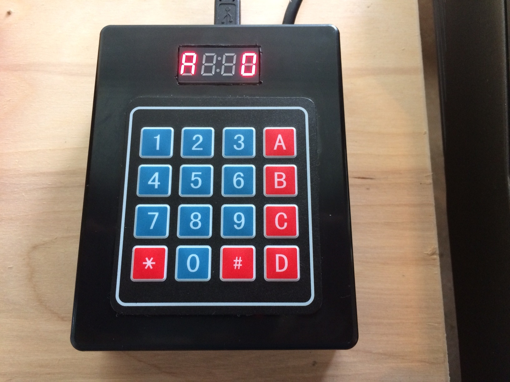

## What is it?

The CZ Patch Library (CZPL) is a little black box with over 1200 patches for the Casio CZ series.  Brasses, basses, pads, leads, percussion, drums, it's all in there.  

## How do I connect it?

Plug the MIDI cable into your Casio CZ-101, CZ-1000, CZ-3000, CZ-5000, or CZ-230S synthesizer and power the CZPL via USB or a 9V power adapter.  

## How do I use it?

Enter the number of the patch you want to hear and press the A button.  The patch is instantly loaded into your Casio's Memory slot A1.  From here you can save the patch to any of your Casio's Memory locations.  Or, browse the library using the # and * keys.

## How can I see it in action?

Here is a video of a preproduction version.  Please note that the production version has over 1200 patches, not the 450 as stated in the video.  

<iframe width="560" height="315" src="https://www.youtube.com/embed/gLdG_PXHO4w?ecver=1" frameborder="0" allowfullscreen></iframe>

## What patches are included?

[Here's the full list.](http://google.com)

## How much is it?

 * Price is $79 USD.
 * Shipping is $10 to the US.  
 * For international shipping, please [contact me](iestyn.lewis@gmail.com) before placing your order.

## How can I get one?

Use the PayPal button here to order via PayPal or credit card.  Please Read All of the Following carefully before ordering:
* The product DOES NOT WORK WITH THE CZ-1.  Do not order one if you plan to use it with a CZ-1!  I hope to get it working with the CZ-1 in the future.  
* The product is MADE-TO-ORDER.  I do not usually have stock in-house.  In most cases your unit will be on its way to you within 2 weeks of your order.  I will communicate with you via email to give you updates along the way.  
* This is a handmade product, which I am trying to provide as inexpensively as possible.  
* I do not have automated production facilities.  Please look at the pictures carefully so you understand exactly what to expect in terms of the way the product looks.
* Refunds offered only with evidence that there is a fault with the product.  

## Can you make it do other things/save patches/work with the CZ-1/work with other synths?

Maybe!  Especially if you're willing to help out with equipment and testing.

## I have other questions!

Contact me:  [iestyn.lewis@gmail.com](iestyn.lewis@gmail.com)
