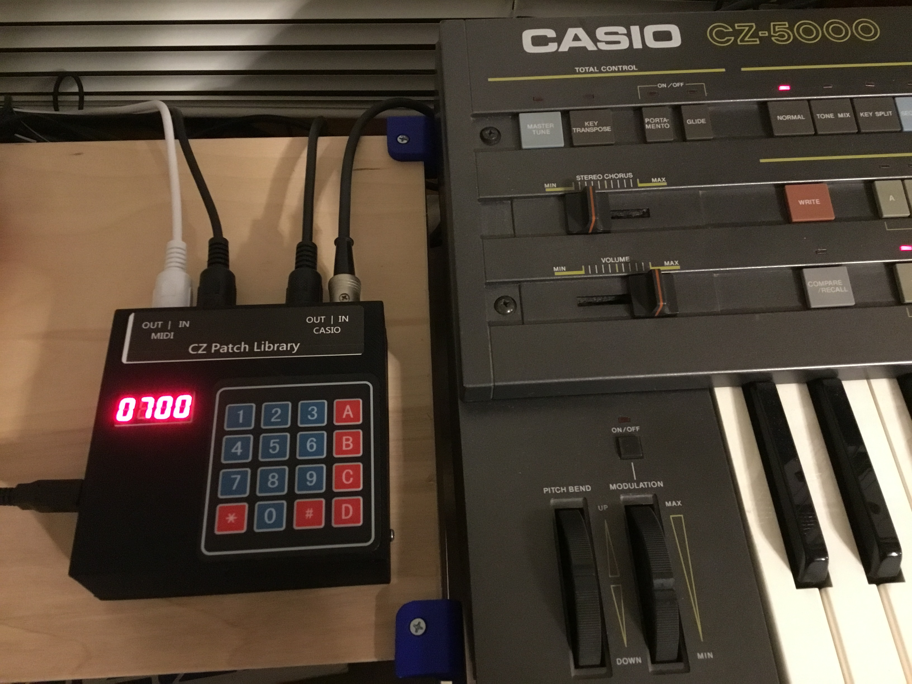
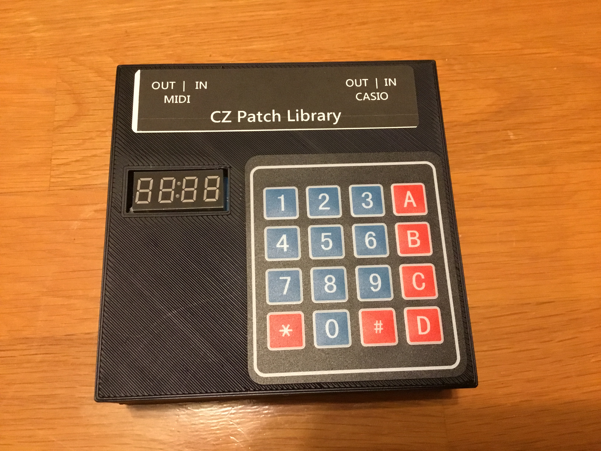
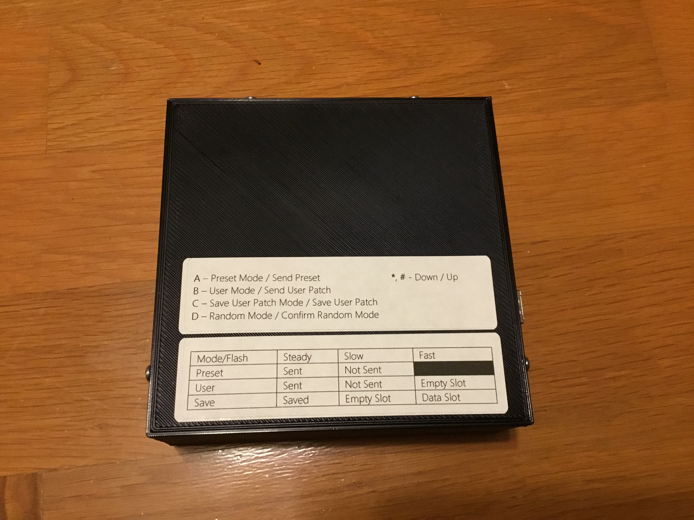
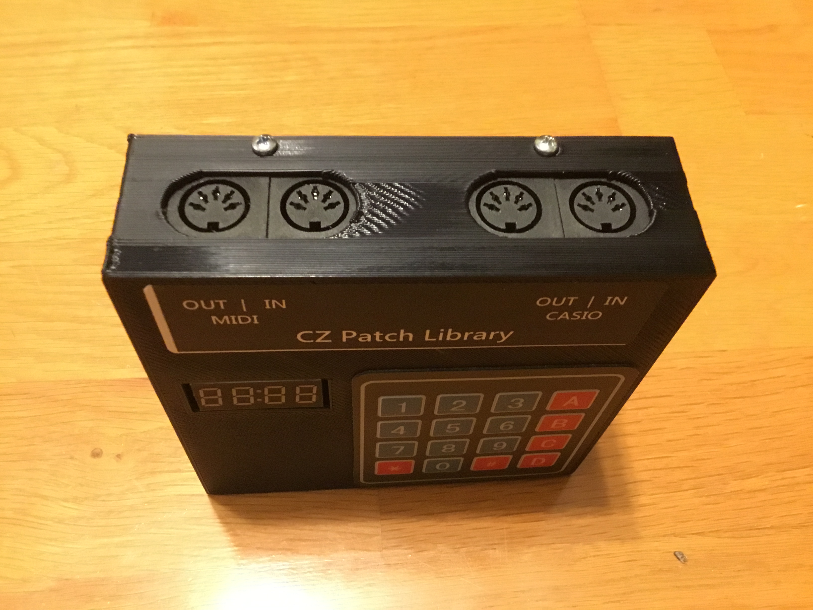

## What is it?

The CZ Patch Library (CZPL) is an essential companion for the Casio CZ series of synthesizers.  It contains:

* 2,186 presets.  Brasses, basses, pads, leads, percussion, drums, it's all in there.  
* 10,000 memory slots to store the patches you create on the CZ!  No longer are you limited to saving only 16 or 32 patches.
* 1,000 memory slots to store entire banks of patches.  Save and recall the entire memory of your synthesizer at once!  Perfect for live performance or building your own custom soundsets.
* An arpeggiator with features from the Roland Jupiter-4 and Korg microKORG arpeggiators.  The Casio CZ series comes to life when you add an arpeggiator.  Latch, keysplit, external and internal trigger.  

<iframe width="720" height="480" src="https://www.youtube.com/embed/WNlZNzl1yuE?ecver=1" frameborder="0" gesture="media" allowfullscreen></iframe>

## How do I connect it?

Connect the CZPL to your Casio CZ-101, CZ-1000, CZ-3000, CZ-5000, CZ-1 or CZ-230S synthesizer with 2 MIDI cables and power the CZPL via USB or a 9V power adapter (center positive).  

You can then connect external gear to the CZPL and all MIDI messages will be passed through to the Casio.  This lets you use sequencers and external controllers without having to unplug and plug cables.

## How do I use it?

<a target="_blank" href="images/CZ%20Patch%20Library%20Manual%20FV%20302.pdf">READ THE MANUAL HERE</a>

## What presets are included?

This is a demonstration of an earlier version, with 1000 patches.  This model contains 1186 more than are shown here!
<iframe width="560" height="315" src="https://www.youtube.com/embed/HUhO5O9OCFc?ecver=1" frameborder="0" allowfullscreen></iframe>

* Basses
* Brasses
* Drums
* FX
* Pianos/EPianos
* Organs
* Strings
* Synths/Leads/Pads
* Tuned Percussion
* Voices
* Winds

<a target="_blank" href="images/CZPL Presets.pdf">VIEW THE FULL LIST HERE</a>

## How much is it?

 * Price is $129 USD.
 * Shipping is $10 to the US.  
 * Shipping is $35 outside the US, as long as USPS Priority Mail delivers to your location.  I must declare the full price of the item on the customs form, please do not ask me to mark it as "gift", etc.
 
## How can I get one?

Scroll down to order via PayPal or credit card.  

*Please Read All of the Following carefully before ordering:*

* The enclosure is 3D printed. 3D printed objects have a textured appearance, please see pictures. 
* Refunds offered with evidence that there is an electronic fault with the product.  

### CURRENT STATUS:  Out of stock.  4 available for pre-order, shipping estimate January 28.

<form action="https://www.paypal.com/cgi-bin/webscr" method="post" target="_top">
<input type="hidden" name="cmd" value="_s-xclick">
<input type="hidden" name="hosted_button_id" value="3SDW49N6AV32C">
<table>
<tr><td><input type="hidden" name="on0" value="Options">Options</td></tr><tr><td><select name="os0">
	<option value="No Power Adapter">No Power Adapter $129.00 USD</option>
	<option value="With Power Adapter">With Power Adapter $134.00 USD</option>
	<option value="No Power Adapter - Int'l Shipping">No Power Adapter - Int'l Shipping $154.00 USD</option>
</select> </td></tr>
<tr><td><input type="hidden" name="on1" value="Your CZ Model:">Your Primary CZ Model:</td></tr><tr><td><select name="os1">
	<option value="-- Select Model --">-- Select Model -- </option>
	<option value="CZ-101">CZ-101 </option>
	<option value="CZ-1000">CZ-1000 </option>
	<option value="CZ-3000">CZ-3000 </option>
	<option value="CZ-5000">CZ-5000 </option>
	<option value="CZ-1">CZ-1</option>
	<option value="CZ-230S">CZ-230S </option>
</select> </td></tr>
</table>
<input type="hidden" name="currency_code" value="USD">
<input type="image" src="https://www.paypalobjects.com/en_US/i/btn/btn_buynowCC_LG.gif" border="0" name="submit" alt="PayPal - The safer, easier way to pay online!">

</form>

## SUPPORT

Please contact me:  <a href="mailto:iestyn.lewis@gmail.com">iestyn.lewis@gmail.com</a>

The latest firmware version is 3.01.  To determine your device's firmware version, unplug your CZPL and plug it back in again.  Immediately after the CZPL "splash" appears, your firmware version will be displayed.  If you do not see a firmware version displayed, you have version 2.0 firmware.  If you would like to upgrade your firmware, please contact me for directions.

### Firmware Version History

* 3.02 - Expanded arp sequence to 64 steps, added Operational Memory bank save/load for CZ-1, added MIDI Bank/Program Change.
* 3.01 - Major version release with CZ-1 support, bank storage and arpeggiator.  <a target="_blank" href="images/CZ%20Patch%20Library%20Manual%20FV%20302.pdf">(v3.01 manual)</a>

* 2.03 - Minor fix (random patch display was not updated).
* 2.02 - Added CZ-230S mode.  Fixed MIDI IN latency problem.
* 2.01 - Added manual random patch selection.
* 2.00 - Initial version.

