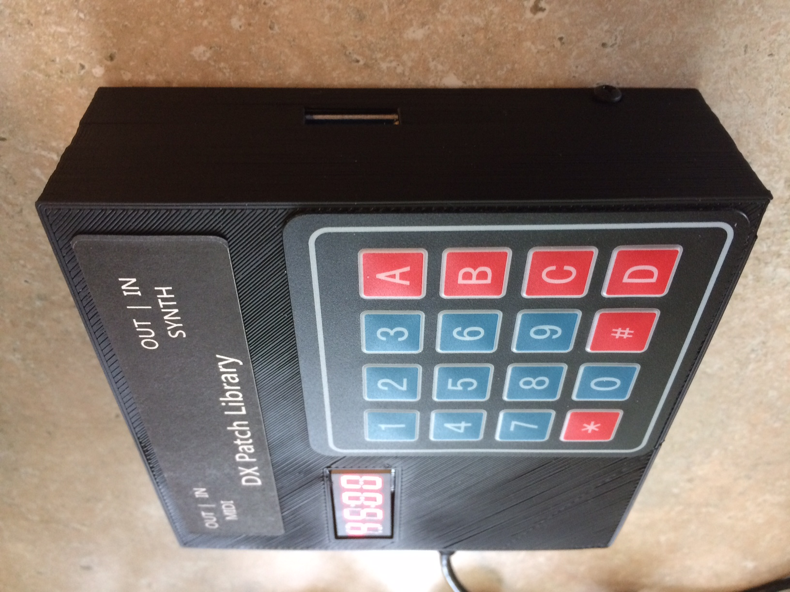

## What is it?

The DX Patch Library (DXPL) is an essential companion for the Yamaha DX series of synthesizers.  It contains:

* 5,026 banks of 32 patches each:  Keys, bells, brasses, basses, pads, leads, it's all in there.  
* 10,000 memory slots to store the patches you create on your DX!  No longer are you limited to saving 32 patches.
* 1,000 memory slots to store entire banks of patches.  Save and recall the entire memory of your synthesizer at once!  Perfect for live performance or building your own custom soundsets.
* An arpeggiator with features from the Roland Jupiter-4 and Korg microKORG arpeggiators.  The Yamaha DX series comes to life when you add an arpeggiator.  Latch, keysplit, external and internal trigger. 
* A MIDI velocity normalizer.  The DX keyboards output velocities from 0-100, which limits their usefulness as MIDI controllers.  The DXPL rescales the output velocity to 0-127 so you can use the DX as a MIDI controller and get full dynamic range from your outboard gear.

<iframe width="720" height="480" src="https://www.youtube.com/embed/WNlZNzl1yuE?ecver=1" frameborder="0" gesture="media" allowfullscreen></iframe>

## How do I connect it?

Connect the DXPL to your Yamaha DX7 synthesizer with 2 MIDI cables and power the DXPL via USB cable (included) or a 9V power adapter (center positive).  

You can then connect external gear to the DXPL and all MIDI messages will be passed through to the Yamaha.  This lets you use sequencers and external controllers without having to unplug and plug cables.

In addition, note on messages from the Yamaha will be translated to values between 0-127.  This means that your DX can finally be used as a master keyboard with modern MIDI velocity values!

## How do I use it?

<a target="_blank" href="images/CZ%20Patch%20Library%20Manual%20FV%20302.pdf">READ THE MANUAL HERE</a>

## What presets are included?

Over 5,000 banks of 32 patches each are preloaded on the DXPL SD Card.  These are banks from around the web, and are GUARANTEED to be unique.  

<a target="_blank" href="images/CZPL Presets.pdf">VIEW THE FULL LIST HERE</a>

## How much is it?

 * Price is $129 USD.
 * Shipping is $10 to the US.  
 * Shipping is $35 outside the US, as long as USPS Priority Mail delivers to your location.  I must declare the full price of the item on the customs form, please do not ask me to mark it as "gift", etc.
 
## How can I get one?

Scroll down to order via PayPal or credit card.  

*Please Read All of the Following carefully before ordering:*

* The enclosure is 3D printed. 3D printed objects have a textured appearance, please see pictures. 
* Refunds offered with evidence that there is an electronic fault with the product.  

### CURRENT STATUS:  4 available for pre-order, shipping on or before Feb 25, 2018.

<form action="https://www.paypal.com/cgi-bin/webscr" method="post" target="_top">
<input type="hidden" name="cmd" value="_s-xclick">
<input type="hidden" name="hosted_button_id" value="3SDW49N6AV32C">
<table>
<tr><td><input type="hidden" name="on0" value="Options">Options</td></tr><tr><td><select name="os0">
	<option value="No Power Adapter">US Shipping - $129.00 + $10 USD</option>
	<!-- <option value="With Power Adapter">With Power Adapter $134.00 USD</option> -->
	<option value="No Power Adapter - Int'l Shipping">International Shipping - $129.00 + $35 USD</option>
</select> </td></tr>
<tr><td><input type="hidden" name="on1" value="Your DX Model:">Your Primary Yamaha DX Model:</td></tr><tr><td><select name="os1">
	<option value="-- Select Model --">-- Select Model -- </option>
	<option value="CZ-101">CZ-101 </option>
	<option value="CZ-1000">CZ-1000 </option>
	<option value="CZ-3000">CZ-3000 </option>
	<option value="CZ-5000">CZ-5000 </option>
	<option value="CZ-1">CZ-1</option>
	<option value="CZ-230S">CZ-230S </option>
</select> </td></tr>
</table>
<input type="hidden" name="currency_code" value="USD">
<input type="image" src="https://www.paypalobjects.com/en_US/i/btn/btn_buynowCC_LG.gif" border="0" name="submit" alt="PayPal - The safer, easier way to pay online!">

</form>

## SUPPORT

Please contact me:  <a href="mailto:iestyn.lewis@gmail.com">iestyn.lewis@gmail.com</a>

The latest firmware version is 2.01.  To determine your device's firmware version, unplug your DXPL and plug it back in again.  Immediately after the DXPL "splash" appears, your firmware version will be displayed.  

### Firmware Version History

* 2.01 - Initial release version.

